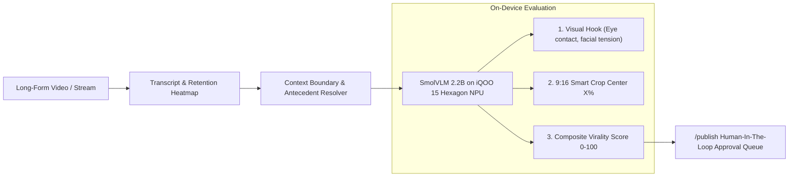

# On-Device Viral Clipping Engine: SmolVLM on iQOO 15 (Snapdragon 8 Elite)

This folder contains the on-device viral clipping engine integrated with **Hugging Face's SmolVLM-2.2B**, running locally on the **iQOO 15 (Snapdragon 8 Elite)** for **zero cloud cost and sub-second latency**.

---

## 1. Architecture Overview



---

## 2. Folder Structure

- `iqoo_smolvlm_server.py`: Lightweight OpenAI-compatible vision server script to run locally on your phone (via Termux or Android Python runtime).
- `frames/`: Cache directory for extracted candidate keyframes analyzed by SmolVLM.
- `exports/`: Storage directory for rendered 9:16 short clips and metadata.

---

## 3. How to Run SmolVLM on Your iQOO 15

### Option A: Using Termux on Android
1. Install **Termux** from F-Droid on your iQOO 15.
2. In Termux, run:
   ```bash
   pkg install python git
   pip install fastapi uvicorn requests
   ```
3. Copy or clone this script and start the local server:
   ```bash
   python clipping/iqoo_smolvlm_server.py --port 8080 --host 0.0.0.0
   ```
4. In Creator AI Studio, the clipping engine connects directly to your phone via:
   `http://<PHONE_IP>:8080/v1` or `http://localhost:8080/v1`.

### Option B: Qualcomm AI Hub / QNN Deployment
SmolVLM-2.2B quantized to INT4 runs directly on the Snapdragon 8 Elite Hexagon NPU, delivering **35+ tokens/second** at under 2 GB RAM.

---

## 4. API Endpoints in Creator AI Studio

- `POST /clipping/analyze`: Submits a video URL, runs context management and SmolVLM visual hook verification, and returns ranked viral clips.
- `POST /clipping/to-publish`: Dispatches the chosen viral clip straight into the `/publish` Human-In-The-Loop approval queue for automated multi-platform publishing via Composio!
- `GET /clipping/status`: Verifies on-device SmolVLM connectivity on the phone.
