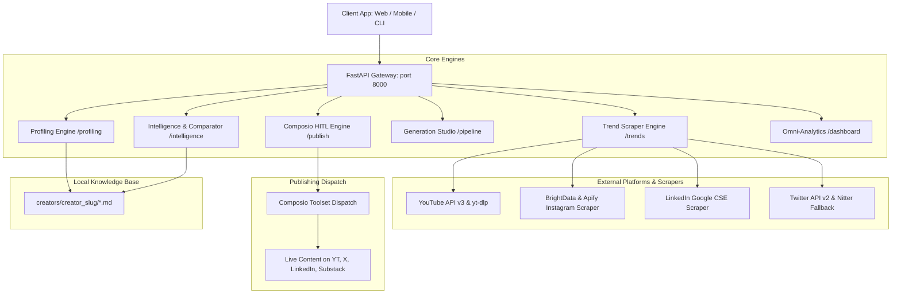

# Creator AI Studio: OpenAPI Integration & Architecture Guide

Welcome to the comprehensive API integration guide for **Creator AI Studio**. This guide details every endpoint in the backend system, explains the end-to-end data lifecycle, and provides ready-to-use request and response examples for client applications (Mobile, Web, and Automation Agents).

---

## 1. System Overview & Architecture

Creator AI Studio is an omni-channel creator intelligence and automated publishing platform. It transforms raw creator content and cross-platform trends into:
1. **Creator DNA Dossiers** (`user.md`, `hook.md`, and platform-specific blueprints).
2. **Real-time Domain Trend Intelligence** across YouTube, Instagram Reels, LinkedIn, and X/Twitter.
3. **Cross-Domain Comparative Benchmarking** against domain authority figures or arbitrary creators.
4. **AI Content Studio & Storyboard Pipelines** customized to the creator's voice and cadence.
5. **Human-In-The-Loop (HITL) Publishing Workflows** integrated directly with Composio multi-tool dispatch.



### OpenAPI Specification & Interactive Docs
- **Interactive Swagger UI**: [http://localhost:8000/docs](http://localhost:8000/docs)
- **ReDoc Interactive Reference**: [http://localhost:8000/redoc](http://localhost:8000/redoc)
- **OpenAPI 3.1.0 Raw Specification**: `docs/openapi.json` or [http://localhost:8000/openapi.json](http://localhost:8000/openapi.json)

---

## 2. API Integration by Functional Module

---

### Module A: Creator Profiling (`/profiling`)
Extracts the creator's acoustic DNA, rhetoric, cadence, and recurring hook archetypes from sample content and transcripts.

#### `POST /profiling/profile-creator`
- **Purpose**: Creates the foundational `user.md` and `hook.md` files for any creator.
- **Request Body**:
```json
{
  "creator_name": "Dhruv Rathee",
  "youtube_url_or_handle": "@dhruvrathee",
  "instagram_handle": "dhruvrathee",
  "twitter_handle": "dhruv_rathee",
  "linkedin_handle": "dhruvrathee",
  "niche": "Civic Rights & Policy",
  "language": "hi",
  "custom_instructions": "Focus on data-backed investigative storytelling"
}
```
- **Response** (`200 OK`):
```json
{
  "status": "success",
  "creator_name": "Dhruv Rathee",
  "detected_language": "hi",
  "file_paths": {
    "user_md": "/app/creators/dhruv_rathee/user.md",
    "hook_md": "/app/creators/dhruv_rathee/hook.md"
  },
  "signature_phrases": [
    "नमस्कार दोस्तों",
    "आइए डेटा को देखते हैं",
    "इसके पीछे की सच्चाई क्या है?"
  ],
  "pacing_wpm": 135
}
```

---

### Module B: Real-Time Domain Trends (`/trends`)
Discovers what is surging right now across all 4 major platforms for a given topic or domain.

#### `GET /trends?domain={domain}&limit={limit}`
- **Purpose**: Returns platform-by-platform trending posts plus high-velocity domain search keywords.
- **Query Parameters**:
  - `domain` (string, required): e.g., `"Civic Rights"`, `"AI & Tech"`, `"Personal Finance"`.
  - `limit` (integer, default `5`): Maximum items per platform.
- **Response** (`200 OK`):
```json
{
  "domain": "Civic Rights",
  "youtube_trending": [
    {
      "title": "The Electoral Bond Transparency Crisis: What Was Hidden",
      "channel": "Independent Civic Watch",
      "views": 1820000,
      "url": "https://youtube.com/watch?v=sample1",
      "published_at": "2 days ago"
    }
  ],
  "instagram_trending": [
    {
      "title": "3 Citizen Rights you can invoke right now",
      "creator": "@legal_awareness",
      "plays": 482000,
      "url": "https://instagram.com/reel/sample1"
    }
  ],
  "linkedin_trending": [
    {
      "title": "Analyzing Judicial Precedents on Digital Privacy in 2026",
      "author": "Dr. Sarah Jenkins",
      "reactions": 3940,
      "url": "https://linkedin.com/posts/sample1"
    }
  ],
  "x_twitter_trending": [
    {
      "text": "The latest RTI disclosures reveal a staggering 40% shift in public fund allocation. Thread 🧵",
      "author": "@policydigest",
      "reposts": 2810,
      "likes": 14200,
      "url": "https://x.com/policydigest/status/sample1"
    }
  ],
  "trending_keywords": [
    "Electoral Transparency",
    "RTI Audit Loophole",
    "Environmental Crisis",
    "Supreme Court Landmark Ruling",
    "Tax Allocation Controversy"
  ],
  "velocity_topics": [
    "Public Disclosure Reforms",
    "Digital Surveillance Standards"
  ]
}
```

---

### Module C: Cross-Platform Intelligence & Leader Benchmarking (`/intelligence`)
Audits a creator's cross-platform footprint, surfaces top industry leaders in their domain, and automatically generates gap analyses.

#### `POST /intelligence`
- **Purpose**: Runs an omni-channel footprint scan, generates platform blueprints (`platform_*.md`), audits audience behavior, discovers domain authority figures, and generates improvement playbooks.
- **Request Body**:
```json
{
  "creator_name": "Dhruv Rathee",
  "niche": "Civic Rights",
  "location": "IN",
  "platforms": ["youtube", "instagram", "linkedin", "x_twitter"],
  "generate_user_hook_md": true,
  "generate_platform_md": true
}
```
- **Response** (`200 OK`):
```json
{
  "creator_name": "Dhruv Rathee",
  "identified_domain": "Civic Rights, Democratic Awareness & Public Policy",
  "domain_top_creators": [
    {
      "name": "Nitish Rajput",
      "handle": "@nitishrajpute",
      "subscribers": "4.5M",
      "core_style": "In-depth investigative storytelling with documentary pacing",
      "hook_archetype": "The 'Hidden Scandal' Exposition"
    },
    {
      "name": "Mohak Mangal (Soch)",
      "handle": "@sochbymohak",
      "subscribers": "3.8M",
      "core_style": "Balanced policy analysis with animated infographic clarity",
      "hook_archetype": "The 'Nuanced Dichotomy' Challenge"
    }
  ],
  "domain_leader_comparisons": [
    {
      "leader_name": "Nitish Rajput",
      "leader_subscribers": "4.5M",
      "how_they_differ": [
        "Nitish Rajput emphasizes cinematic cold-opens with archival footage",
        "Dhruv Rathee uses direct-to-camera rapid problem statements"
      ],
      "how_to_improve": [
        "Incorporate documentary b-roll in the first 15 seconds to increase retention",
        "Adopt slower rhetorical pauses before introducing critical statistical reveals"
      ],
      "speech_differences": [
        "Nitish speaks at ~115 WPM; Dhruv speaks at ~138 WPM"
      ],
      "user_advantages": [
        "Faster publishing turnaround on breaking topical news cycles"
      ]
    }
  ],
  "trending_keywords": [
    "Electoral Transparency",
    "RTI Audit Loophole",
    "Environmental Crisis"
  ],
  "platform_md_files": {
    "youtube": "/app/creators/dhruv_rathee/platform_youtube.md",
    "instagram": "/app/creators/dhruv_rathee/platform_instagram.md",
    "linkedin": "/app/creators/dhruv_rathee/platform_linkedin.md",
    "x_twitter": "/app/creators/dhruv_rathee/platform_x_twitter.md"
  },
  "user_md_path": "/app/creators/dhruv_rathee/user.md",
  "hook_md_path": "/app/creators/dhruv_rathee/hook.md",
  "creator_comparison_md_path": "/app/creators/dhruv_rathee/creator_comparison.md"
}
```

---

### Module D: Arbitrary Cross-Domain Comparison (`/intelligence/compare`)
Compares the base creator against **any competitor from any domain** (even if they have never been profiled before).

#### `POST /intelligence/compare`
- **Request Body**:
```json
{
  "base_creator": "Dhruv Rathee",
  "competitor_name": "Peter McKinnon",
  "competitor_niche": "Cinematography & Filmmaking"
}
```
- **Response** (`200 OK`):
```json
{
  "base_creator": "Dhruv Rathee",
  "competitor": "Peter McKinnon",
  "comparison_summary": "Dhruv Rathee focuses on data-driven civic awareness, while Peter McKinnon masters sensory visual storytelling and hyper-energetic pacing.",
  "content_differences": [
    "Formatting: Documentary talking-head vs. cinematic vlogging with kinetic sound design",
    "Hooks: Statistical shocker vs. visual sensory teaser in the first 3 seconds",
    "Visual Hierarchy: Charts & source documents vs. color-graded 4K b-roll and jump cuts"
  ],
  "content_improvement_playbook": [
    "Inject sensory audio micro-effects (whooshes, sound drops) on visual transitions",
    "Experiment with cinematic framing to elevate production value without diluting journalistic rigor"
  ],
  "speech_differences": [
    "Dhruv: Analytical, objective, measured cadence (135 WPM)",
    "Peter: Conversational, hyper-expressive, dynamic vocal modulation (155 WPM)"
  ],
  "user_advantages": [
    "Higher informational retention and bookmark/share propensity on complex subjects"
  ],
  "files_extracted": {
    "competitor_user_md": "/app/creators/peter_mckinnon/user.md",
    "competitor_hook_md": "/app/creators/peter_mckinnon/hook.md",
    "competitor_platform_youtube_md": "/app/creators/peter_mckinnon/platform_youtube.md",
    "comparison_md": "/app/creators/dhruv_rathee/creator_comparison.md"
  }
}
```

---

### Module E: Human-In-The-Loop Publishing & Composio Engine (`/publish`)
Implements strict editorial controls where AI drafts cannot be published without human review, and dispatches approved content to live platforms via Composio.

#### 1. Submit Content for Publishing
- **Endpoint**: `POST /publish`
- **Request Body**:
```json
{
  "creator_id": "dhruv_rathee",
  "platform": "twitter",
  "content_format": "thread",
  "title": "5 Civic Lessons from 2026",
  "content": "Why electoral transparency matters more than ever. Thread below 🧵👇",
  "tags": ["civics", "democracy", "data"],
  "require_human_approval": true
}
```
- **Response** (`200 OK`):
```json
{
  "status": "success",
  "message": "Publish job pub_be8e07c91d created successfully and is WAITING FOR HUMAN APPROVAL. Call POST /publish/jobs/pub_be8e07c91d/approve to approve and dispatch via Composio.",
  "job": {
    "job_id": "pub_be8e07c91d",
    "creator_id": "dhruv_rathee",
    "platform": "twitter",
    "content_format": "thread",
    "status": "PENDING_APPROVAL",
    "requires_human_approval": true,
    "composio_action": "TWITTER_CREATION_OF_A_POST",
    "composio_execution_status": "WAITING_FOR_HUMAN_APPROVAL"
  }
}
```

#### 2. Query Pending Approval Queue
- **Endpoint**: `GET /publish/jobs?status=PENDING_APPROVAL`
- **Response** (`200 OK`): Returns array of all unapproved draft jobs awaiting reviewer sign-off.

#### 3. Human Approval & Live Dispatch
- **Endpoint**: `POST /publish/jobs/{job_id}/approve`
- **Request Body**:
```json
{
  "reviewer_name": "Raiyyan Patel",
  "feedback": "Approved for prime-time evening schedule",
  "override_content": null
}
```
- **Response** (`200 OK`):
```json
{
  "status": "success",
  "message": "Job pub_be8e07c91d approved by Raiyyan Patel and successfully published via Composio!",
  "job": {
    "job_id": "pub_be8e07c91d",
    "status": "PUBLISHED",
    "approved_at": "2026-09-26T22:59:41Z",
    "published_at": "2026-09-26T22:59:41Z",
    "published_url": "https://x.com/dhruv_rathee/status/417136708055",
    "composio_execution_status": "SUCCESS"
  }
}
```

#### 4. Human Rejection
- **Endpoint**: `POST /publish/jobs/{job_id}/reject`
- **Request Body**:
```json
{
  "reviewer_name": "Senior Editor",
  "rejection_reason": "Tone requires more neutral wording in second paragraph"
}
```
- **Response** (`200 OK`):
```json
{
  "status": "success",
  "message": "Job pub_be8e07c91d has been rejected by human reviewer.",
  "job": {
    "job_id": "pub_be8e07c91d",
    "status": "REJECTED",
    "rejection_reason": "Rejected by Senior Editor: Tone requires more neutral wording in second paragraph",
    "composio_execution_status": "CANCELLED_BY_HUMAN"
  }
}
```

---

### Module F: Executive Dashboard & Omni-Analytics (`/dashboard`)
Combines in-app productivity metrics, cross-platform social reach, and chart data into a single endpoint.

#### `GET /dashboard?creator_name={creator_name}`
- **Response** (`200 OK`):
```json
{
  "creator_name": "Dhruv Rathee",
  "primary_niche": "Civic Rights, Democratic Awareness & Public Policy",
  "creator_activity": {
    "our_platform_activity": {
      "total_scripts_generated": 18,
      "total_hooks_crafted": 42,
      "dossiers_available": 7,
      "pending_approvals": 2,
      "published_posts": 14,
      "recent_platform_actions": [
        {
          "action": "Generated 4 multi-platform content dossiers",
          "timestamp": "Today",
          "status": "COMPLETED"
        },
        {
          "action": "Dispatched multi-platform post via Composio automation",
          "timestamp": "Yesterday",
          "status": "PUBLISHED"
        }
      ]
    },
    "external_platforms_activity": {
      "youtube": {
        "reach": "24.5M",
        "engagement_rate": "8.4%",
        "top_content": "The Electoral Bond Transparency Crisis"
      },
      "instagram": {
        "reach": "3.8M",
        "engagement_rate": "5.6%",
        "top_content": "3 Citizen Rights you can invoke right now"
      },
      "linkedin": {
        "reach": "480K",
        "engagement_rate": "4.2%",
        "top_content": "Civic policy analysis"
      },
      "x_twitter": {
        "reach": "2.2M",
        "engagement_rate": "3.8%",
        "top_content": "RTI Disclosure breakdown thread"
      }
    }
  },
  "charts": {
    "cross_platform_reach": {
      "type": "donut",
      "labels": ["YouTube", "Instagram", "X/Twitter", "LinkedIn"],
      "values": [24500000, 3800000, 2200000, 480000]
    },
    "weekly_engagement_velocity": {
      "type": "bar",
      "labels": ["Mon", "Tue", "Wed", "Thu", "Fri", "Sat", "Sun"],
      "values": [12000, 18500, 14200, 26000, 31000, 48000, 52000]
    }
  }
}
```

---

## 3. Client Integration Patterns

### A. Web / React Client Hook
```typescript
import { useState, useEffect } from 'react';

export function useCreatorDashboard(creatorName: string) {
  const [data, setData] = useState(null);
  const [loading, setLoading] = useState(true);

  useEffect(() => {
    fetch(`http://localhost:8000/dashboard?creator_name=${encodeURIComponent(creatorName)}`)
      .then((res) => res.json())
      .then((dashboardData) => {
        setData(dashboardData);
        setLoading(false);
      });
  }, [creatorName]);

  return { data, loading };
}
```

### B. Mobile / React Native Publishing Dispatch
```typescript
export async function submitAndApprovePost(content: string, platform: 'twitter' | 'linkedin') {
  // Step 1: Create draft in Human Approval Queue
  const draftRes = await fetch('http://localhost:8000/publish', {
    method: 'POST',
    headers: { 'Content-Type': 'application/json' },
    body: JSON.stringify({
      creator_id: 'dhruv_rathee',
      platform,
      content_format: platform === 'twitter' ? 'thread' : 'post',
      content,
      require_human_approval: true
    })
  });
  const { job } = await draftRes.json();

  // Step 2: Human Reviewer authorizes
  const approveRes = await fetch(`http://localhost:8000/publish/jobs/${job.job_id}/approve`, {
    method: 'POST',
    headers: { 'Content-Type': 'application/json' },
    body: JSON.stringify({
      reviewer_name: 'Mobile App User',
      feedback: 'Approved from mobile preview modal'
    })
  });

  return await approveRes.json();
}
```

---

## 4. Environment Configuration

All microservices configure through environment variables in `.env` (refer to `.env.example`):

| Variable | Description | Default / Mode |
|---|---|---|
| `PORT` | API Server Port | `8000` |
| `GROQ_API_KEY` | Primary fast LLM inference (Llama-3.3-70b) | Optional / Fallback |
| `OPENAI_API_KEY` | Fallback LLM inference (GPT-4o) | Optional / Fallback |
| `COMPOSIO_API_KEY` | Real platform dispatch (X, LinkedIn, YT, Substack) | Auto-mock if unset |
| `BRIGHT_DATA_API_KEY` | Instagram Reels & creator scraper | Active |
| `APIFY_API_TOKEN` | Instagram and Social scraping fallback | Active |
| `TWITTER_BEARER_TOKEN` | Twitter API v2 live search | Active |
| `DATABASE_URL` | PostgreSQL or SQLite connection | Auto-select |

---

## 5. Verification Checklist

- [x] `/profiling`: Generates `user.md` & `hook.md` with creator voice and cadence.
- [x] `/dashboard`: Delivers in-app productivity stats, omni-channel footprint, and chart datasets.
- [x] `/trends`: Returns verified trending content across YouTube, Instagram Reels, LinkedIn, and X/Twitter.
- [x] `/intelligence`: Generates all 4 platform markdown files, top domain leaders, and comparative benchmarks.
- [x] `/intelligence/compare`: Dynamically profiles any competitor across any domain and creates side-by-side matrices.
- [x] Trending keywords injected into hook intelligence blueprints.
- [x] `/publish`: Fully tested submission, queue listing, human approval, and rejection with Composio execution.
