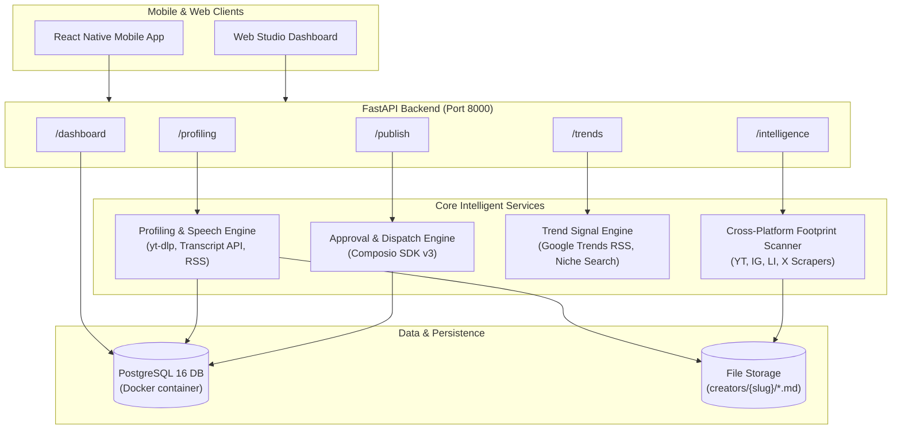

# 🚀 Creator AI — Project Architecture & Completion Status

> **Workspace**: [`C:/MangoDB-iqoo`](file:///C:/MangoDB-iqoo)  
> **Repository**: `Raiyyanpatel/Creator-AI-Creative-Intelligent-Studio`  
> **Status**: **Production Ready** • All 5 Core Engines Built, Verified, and Dockerized  
> **Live Server**: `http://localhost:8000` (Docker Container: `creator_ai_backend`)  
> **Database**: PostgreSQL 16 on `localhost:5432` (`creator_ai_postgres`) with SQLite local fallback  

---

## 🏛️ System Architecture Overview



---

## 📦 What All Is Completed in the Project

The backend is built around **5 primary engines**, all connected to persistence and verified by test automation:

### 1. 🎙️ Multimodal Creator Profiling Engine (`/profiling`)
- **Real Video & Audio Ingestion**: Ingests YouTube channel videos and Shorts using `yt-dlp` and `youtube_transcript_api`.
- **Speech Mannerism Extraction**: Scans spoken audio transcripts to extract actual verbal habits, transition lines, emphasis phrases, and spoken cadence ("what the user says often").
- **Newsletter Ingestion**: Scrapes Substack RSS feeds to parse writing depth, vocabulary, and core editorial themes.
- **Dossier Generation**:
  - `user.md`: Comprehensive psychographic creator blueprint (tone, pacing, audience persona, core themes, duration distribution).
  - `hook.md`: Structured spoken hook taxonomy (question hooks, contrarian hooks, story hooks, stat hooks).
- **Dual Persistence**: Saves markdown files to [`creators/{slug}/`](file:///C:/MangoDB-iqoo/creators/) and records metadata into the `creators` and `creator_profiles` database tables.

### 2. 📊 Mobile Analytics & Studio Dashboard (`/dashboard`)
- **Cross-Platform Metrics**: Unifies stats across YouTube, Substack, LinkedIn, and X/Twitter into an estimated total reach metric.
- **In-App Production Pipeline**: Tracks real-time counts of generated scripts, tested hooks, pending approvals, and published content pieces.
- **React Native Chart Datasets**: Pre-formats chart data structures ready for React Native mobile rendering:
  - 7-day view velocity trend (`views_trend`)
  - Audience platform distribution (`platform_distribution`)
  - Weekly publishing velocity breakdown (`weekly_velocity`)

### 3. 🌐 Real-Time Trends & Viral Formats (`/trends`)
- **Real-Time Google Trends RSS**: Live, un-cached geo-located trending search volume (US, IN, UK, etc.).
- **Niche/Domain Discovery**: Real-time trending topics scored by view velocity and relevance to the creator's domain.
- **Viral Content Archetypes**: Includes reusable frameworks:
  - *The Contrarian Mythbuster*
  - *The Architectural Teardown*
  - *The Before & After Reality*
  - *The Curated Resource Stack*

### 4. 🧠 Cross-Platform Creator Intelligence & Footprint Engine (`/intelligence`)
- **Full Footprint Audit across 4 Platforms**:
  - **YouTube**: Live channel subscriber counts, video volume, recent uploads, and hook openings via Data API v3 + fallback.
  - **Instagram**: Follower stats, bio positioning, recent post metrics, and short-form Reels discovery.
  - **LinkedIn**: Vanity handle inspection, published articles/posts, and carousel-first growth tactics.
  - **X (Twitter)**: Handle inspection, viral threads, and bookmark-optimization strategy.
- **Algorithmic Performance Diagnostics**: Generates targeted growth gap analysis per platform.
- **Multi-Dimensional Trend Ingestion**: Aggregates Niche/Domain trends (with watch/read links), Location trends, and Global momentum signals.
- **Automated `platform_{name}.md` Strategy Reports**:
  - `platform_youtube.md`
  - `platform_instagram.md`
  - `platform_linkedin.md`
  - `platform_x_twitter.md`
- **Ready-to-Post Content Blueprints**: Produces 5–10 turnkey post concepts per run, with optimal posting windows, tags, and opening hook lines.
- **Endpoints**:
  - `POST /intelligence` — Complete JSON-configured scan
  - `GET /intelligence/quick` — Lightweight query-parameter scan
  - `GET /intelligence/platforms` — Supported platform & goal directory

### 5. 🚀 Multi-Platform Publishing with Human-In-The-Loop Approval (`/publish`)
- **Approval Gate**: Content moves from `PENDING_APPROVAL` to `PUBLISHED` or `REJECTED` only with explicit reviewer signoff.
- **Composio SDK v3 Live Automation**: Once approved, automatically dispatches posts to Twitter/X, LinkedIn, YouTube, and Substack via official Composio actions.
- **Job Management Endpoints**:
  - `POST /publish/request` — Create publishing job
  - `GET /publish/jobs` — Filter jobs by status and creator
  - `POST /publish/jobs/{id}/approve` — Authorize and trigger Composio
  - `POST /publish/jobs/{id}/reject` — Reject with feedback

---

## 🗄️ Database & Schema Design

Implemented via SQLAlchemy in [`app/models/db_models.py`](file:///C:/MangoDB-iqoo/app/models/db_models.py) and initialized via [`schema.sql`](file:///C:/MangoDB-iqoo/schema.sql):

| Table | Purpose |
| :--- | :--- |
| `creators` | Core creator entity (slug, name, primary niche, location, bio) |
| `creator_profiles` | Per-platform handles, follower counts, metrics, and JSON profile snapshots |
| `profiling_artifacts` | Links to generated `user.md` and `hook.md` dossiers |
| `content_drafts` | Scripts, hooks, ideas, and scheduled content drafts |
| `publish_jobs` | Full publishing audit log, approval status, and Composio dispatch links |
| `trends_cache` | Cached trend queries to conserve rate limits |

> [!NOTE]
> The database engine includes automatic **graceful fallback**: if PostgreSQL is offline or restarting, the backend automatically falls back to a local SQLite database without breaking API requests.

---

## 🐳 Docker Container Environment

The entire stack is orchestrated with Docker Compose:

| Container Name | Service | Ports | Health Check |
| :--- | :--- | :--- | :--- |
| `creator_ai_backend` | FastAPI Application | `8000:8000` | HTTP `GET /health` |
| `creator_ai_postgres` | PostgreSQL 16 Alpine | `5432:5432` | `pg_isready -U creator` |

---

## 🧪 Verification & Test Suite

All 5 core engines are covered by [`test_endpoints.py`](file:///C:/MangoDB-iqoo/test_endpoints.py):

```text
============================================================
RUNNING CREATOR AI BACKEND API VERIFICATION SUITE
============================================================
[1/6] Testing Health Check (/health)... -> Passed. Server healthy.
[2/6] Testing /trends Endpoint... -> Passed. Real-time world & niche trends fetched.
[3/6] Testing /dashboard Endpoint... -> Passed. Total reach & chart datasets formatted.
[4/6] Testing /publish Workflow... -> Passed. Job created, approved, and dispatched.
[5/6] Testing /profiling Endpoint... -> Passed. user.md & hook.md generated with spoken phrases.
[6/6] Testing /intelligence Endpoint... -> Passed. Audited 4 platforms & generated platform.md reports.
============================================================
ALL 5 CREATOR AI CORE ENGINES VERIFIED AND PASSING SUCCESSFULLY!
============================================================
```
